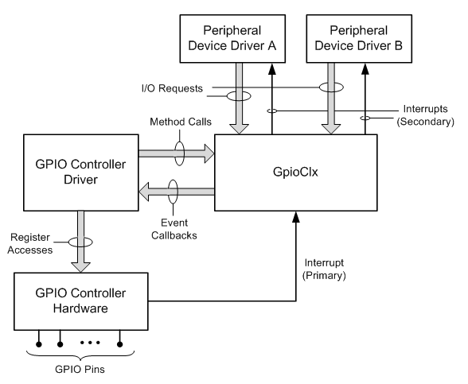

# GPIO overview
`GPIO (General Purpose I/O Ports)` 意思为通用输入/输出端口，通俗地说，就是一些引脚，可以通过它们输出高低电平或者通过它们读入引脚的状态-是高电平或是低电平。

GPIO口一是个比较重要的概念, 用户可以通过GPIO口和硬件进行数据交互(如UART), 控制硬件工作(如LED、蜂鸣器等), 读取硬件的工作状态信号（如中断信号）等, GPIO口的使用非常广泛。

在嵌入式系统中常常有数量众多，但是结构却比较简单的外部设备/电路，对这些设备/电路有的需要CPU为之提供控制手段，有的则需要被CPU用作输入信号。而且，许多这样的设备/电路只要求一位，即只要有开/关两种状态就够了，比如灯亮与灭。对这些设备/电路的控制，使用传统的串行口或并行口都不合适。所以在微控制器芯片上一般都会提供一个“通用可编程IO接口”，即GPIO。接口至少有两个寄存器，即“通用IO控制寄存器”与“通用IO数据寄存器”。数据寄存器的各位都直接引到芯片外部，而对数据寄存器中每一位的作用，即每一位的信号流通方向时输入还是输出，则可以通过控制寄存器中对应位独立的加以设置。这样，有无GPIO接口也就成为微控制器区别于微处理器的一个特征。
 
在实际的MCU中，GPIO是有多种形式的。比如，有的数据寄存器可以按照位寻址，有些却不能按照位寻址，这在编程时就要区分了。比如传统的8051系列，就区分成可位寻址和不可位寻址两种寄存器。另外，为了使用的方便，很多mcu把glue logic等集成到芯片内部，增强了系统的稳定性能，比如GPIO接口除去两个标准寄存器必须具备外，还提供上拉寄存器，可以设置IO的输出模式是高阻，还是带上拉的电平输出，或者不带上拉的电平输出。这在电路设计中，外围电路就可以简化不少。

例如：S3C2410共有117个I/O端口，共分为A~H共8组：GPA、GPB、...、GPH。S3C2440共有130个I/O端口，分为A~J共9组：GPA、GPB、...、GPJ。

可以通过设置寄存器来确定某个引脚用于Input、Output或者其它特殊功能，For example, 可以设置GPH6作为输入、输出或者用于串口。

> For SoC-based platforms, Windows defines a general abstraction for GPIO hardware, and this abstraction requires support from the Advanced Configuration and Power Interface (ACPI) namespace.

# GPIO controller devices
Windows支持GPIO controllers，而且GPIO controllers可以为外设提供多种functions，包括interrupts, input signaling以及output signaling. 

> GPIO capabilities are modeled as a GPIO controller device in the namespace. 
The GPIO framework extension (GpioClx) models the GPIO controller device as 
being partitioned into some number of banks of pins.

## GPIO Controller Drivers
在Windows平台上，`GPIO framework extension (GpioClx)`简化了GPIO controller device driver的编写工作，

硬件厂商提供drivers来operate相应的GPIO controllers，
一个GPIO Controller Driver同样也是一个`kernel-mode driver framework (KMDF)` driver，
针对一个GPIO controller，提供 all hardware-specific operations。

GPIO controller driver 将会与 `GpioClx` 协作处理来自 GPIO pins 的 `I/O requests` or `interrupt requests`，
前提是GPIO pins are configured as `data inputs`, `data outputs` or `interrupt inputs`.

GPIO controller device拥有多个GPIO pins, 这些pins可以物理连接到外设上，也可以被配置为`data inputs`, `data outputs` or `interrupt inputs`。典型地，一个GPIO pin只能专用于一个外设，一旦GPIO pin与外设之间建立起connection关系，则不可以人为的change connection。GPIO pins和外设的connect关系可在platform firmware
中定义(ACPI?)。

下图描述的是`GPIO Controller Driver`和`GpioClx`

利用`GpioClx device-driver interface (DDI)`, `GPIO Controller Driver`和`GpioClx`相互通信。
`driver support methods`由`GpioClx`实现，提供给`GPIO Controller Driver`使用；
`event callback functions`由`GPIO Controller Driver`实现，提供给`GpioClx`使用。

通过hardware registers，`GPIO Controller Driver`可以直接访问`GPIO controller device`.

More info refer to `https://docs.microsoft.com/zh-cn/windows-hardware/drivers/gpio/gpio-driver-support-overview`